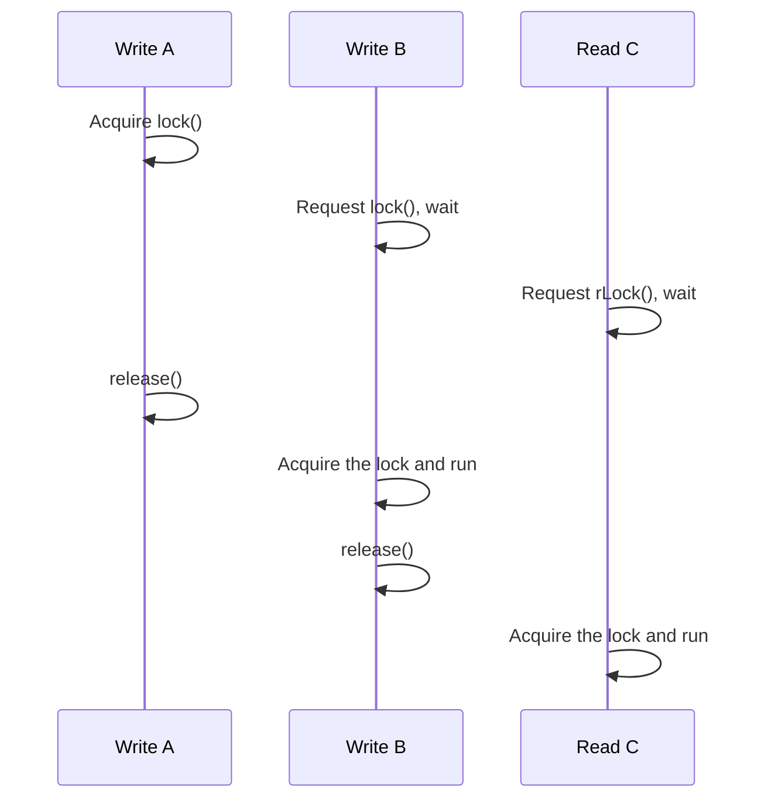

## Lock types \{#lock-types\}

asyncmux handles two kinds of locks.

- **Write lock (W)** — An exclusive lock. It conflicts with locks on the same target (the same key in the `Asyncmux` class).
- **Read lock (R)** — A shared lock. It can coexist with read locks on the same target (the same key in the `Asyncmux` class).

The decorator API and the function API hold a single lock state per target object. The `Asyncmux` class additionally holds per-key state, and keyless requests act as global locks that conflict with everything.

## Ordering guarantees \{#ordering\}

Requests on the same target (the same key in the `Asyncmux` class) run in the following order.

| Request sequence | Execution order                 |
| ---------------- | ------------------------------- |
| W → W            | Arrival order (FIFO)            |
| W → R            | R runs after W completes        |
| R → W            | W runs after all Rs are freed   |
| R → R            | Concurrent (order not guaranteed) |

While a write lock is waiting, a later-arriving read lock never overtakes it. Reads never starve a write, no matter how many arrive in a row.



In the `Asyncmux` class, non-conflicting requests (such as different keys) can overtake the wait queue and be acquired immediately. Overtaking only happens when there is no conflicting request, so per-key FIFO is preserved.

## Reentrancy detection \{#reentrancy\}

While a decorator-locked method is running, the lock target and the held lock kind are recorded in the async context. Requesting a lock on the same target while holding it throws `ReentrantLockError` to prevent deadlocks.

| Held lock | Requested lock | Result                   |
| --------- | -------------- | ------------------------ |
| W         | W              | `ReentrantLockError`     |
| W         | R              | `ReentrantLockError`     |
| R         | W              | `ReentrantLockError`     |
| R         | R              | Allowed (as a shared lock) |

### Detection scope \{#reentrancy-scope\}

- While a decorated method is running, reentrancy across `await` is also detected (when `AsyncLocalStorage` is available).
- Circular waits across multiple objects are also detected.

```ts cycle.ts
class A {
  @asyncmux
  async m(b: B) {
    await b.m(this);
  }
}

class B {
  @asyncmux
  async m(a: A) {
    await a.m(this); // Fails because it re-enters A while holding A's lock.
  }
}

const b = new B();
await new A().m(b); // ReentrantLockError
```

- In environments without `AsyncLocalStorage`, only the synchronous call scope is detected. Reentrancy across `await` is not detected.
- The function API does not register a context, so it detects no reentrancy except while a decorated method is running.
- The `Asyncmux` class does not detect reentrancy by default. With the `preventReentrancy` option, it detects reentrancy with the same conflict rules.

:::warning
In combinations where reentrancy is not detected, the lock request waits forever. When using the function API, or when `preventReentrancy` is not enabled in the `Asyncmux` class, avoid acquiring the same lock twice.
:::

## State cleanup \{#cleanup\}

Lock state is freed once its target object or key is no longer needed.

- Decorator and function API state is managed with a `WeakMap`. Once the target object is garbage-collected, its state is collected as well. When every lock is released and the wait queue is empty, the entry is removed.
- Per-key counters in the `Asyncmux` class are also removed once their hold count reaches 0.
