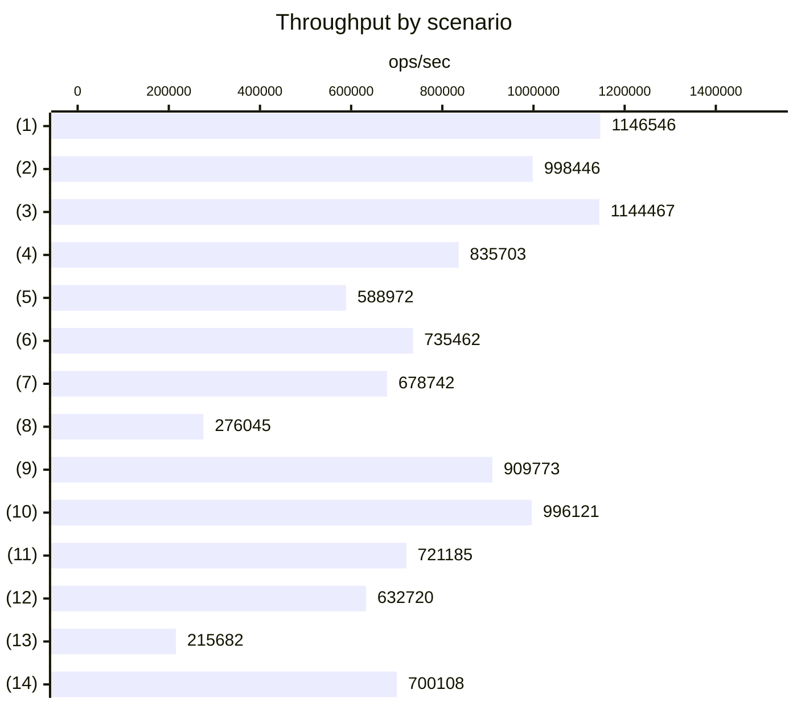

## Environment \{#environment\}

| Item    | Value                                |
| ------- | ------------------------------------ |
| CPU     | 12th Gen Intel(R) Core(TM) i9-12900K |
| OS      | Linux x64                            |
| Node.js | v24.15.0                             |
| Vitest  | 4.1.11                               |
| Date    | 2026-09-26                           |

Measurements used `packages/asyncmux/benchmarks/asyncmux.bench.ts`, run with the following command.

```sh
npx vitest bench --config ./.config/vitest.bench.ts --run
```

:::note
Benchmark numbers vary depending on the machine and concurrently running processes. The values shown here are measurements on a specific machine and do not guarantee performance.
:::

## Throughput \{#throughput\}

The horizontal axis shows lock acquisitions per second. Scenarios where a single run performs multiple lock operations are normalized by the number of lock operations per run. The "(n)" in the chart corresponds to the "Operation" column in [Operations and results](#results).



## Operations and results \{#results\}

The table lists the median `hz` (runs per second) of 3 measurements. "Lock acquisitions/sec" is normalized by multiplying by the number of lock operations per run. The two abort scenarios never acquire a lock and are excluded from the chart.

| Operation | Description                                      | Lock ops/run | Runs/sec | Lock acquisitions/sec |
| --------- | ------------------------------------------------ | -----------: | -------: | --------------------: |
| (1)       | lock / release (no key)                          |            1 | 1,146,546 |             1,146,546 |
| (2)       | lock / release (key)                             |            1 |   998,446 |               998,446 |
| (3)       | rLock / release                                  |            1 | 1,144,467 |             1,144,467 |
| (4)       | rLock / release (key)                            |            1 |   835,703 |               835,703 |
| (5)       | 2 workers x 4 ops (same key)                     |            8 |    73,622 |               588,972 |
| (6)       | 2 workers x 16 ops (same key)                    |           32 |    22,983 |               735,462 |
| (7)       | 32 concurrent requests (no key)                  |           32 |    21,211 |               678,742 |
| (8)       | 128 concurrent requests (same key)               |          128 |     2,157 |               276,045 |
| (9)       | sequential x 16                                  |           16 |    56,861 |               909,773 |
| (10)      | sequential x 64                                  |           64 |    15,564 |               996,121 |
| (11)      | drain 50 queued R/W requests                     |           50 |    14,424 |               721,185 |
| (12)      | drain 200 queued R/W requests                    |          200 |     3,164 |               632,720 |
| (13)      | double release (throws LockReleasedError)        |            1 |   215,682 |               215,682 |
| (14)      | reader-writer cache access (12R + 3W + global W) |           16 |    43,757 |               700,108 |
| —         | immediately aborted signal (rejects)             |            — |   152,145 |                     — |
| —         | abort while waiting in queue                     |            — |    96,851 |                     — |

## Observations \{#observations\}

- Uncontended lock acquisition and release runs at about 1M operations per second.
- Read lock throughput is on par with write locks.
- With 128 concurrent requests on the same key, throughput drops to about 280K/sec while preserving mutual exclusion and FIFO.
- Error paths such as double release and aborts also handle 90K+ operations per second.

## Re-running \{#rerun\}

Benchmarks are defined in `packages/asyncmux/benchmarks/asyncmux.bench.ts`. To measure on your own machine, run the following command in `packages/asyncmux`.

```sh
npx vitest bench --config ./.config/vitest.bench.ts --run
```
