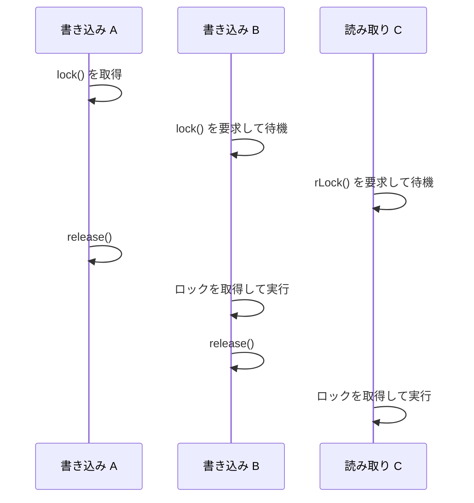

## ロックの種類 \{#lock-types\}

asyncmux が扱うロックは 2 種類です。

- **書き込みロック（W）** — 排他ロックです。同じ対象（`Asyncmux` クラスでは同じキー）のロックと競合します。
- **読み取りロック（R）** — 共有ロックです。同じ対象（`Asyncmux` クラスでは同じキー）の読み取りロックと共存できます。

デコレーター API と関数 API は対象オブジェクトごとに 1 つのロック状態を持ちます。`Asyncmux` クラスはこれに加えてキーごとの状態を持ち、キーを指定しない要求はグローバルロックとしてすべてと競合します。

## 実行順序の保証 \{#ordering\}

同じ対象（`Asyncmux` クラスでは同じキー）に対する要求の実行順は次のとおりです。

| 要求の並び | 実行順 |
| --- | --- |
| W → W | 到着順（FIFO） |
| W → R | W の完了後に R |
| R → W | すべての R が解放された後に W |
| R → R | 並行（実行順は保証しない） |

待機中の書き込みロックがある間、後から到着した読み取りロックは書き込みロックより先に進みません。読み取りが連続しても書き込みが待たされ続けることはありません。



`Asyncmux` クラスでは、競合しない要求（異なるキーなど）は待機キューを飛び越えてそのまま取得できます。飛び越えが起きるのは競合する要求が 1 つもない場合だけなので、キーごとの FIFO は保たれます。

## 再入の検出 \{#reentrancy\}

デコレーターでロックされたメソッドの実行中は、ロック対象と保持中のロック種別が非同期コンテキストに記録されます。ロックを保持したまま同じ対象のロックを要求すると、デッドロックを防ぐために `ReentrantLockError` が投げられます。

| 保持中のロック | 要求するロック | 結果 |
| --- | --- | --- |
| W | W | `ReentrantLockError` |
| W | R | `ReentrantLockError` |
| R | W | `ReentrantLockError` |
| R | R | 許可（共有ロックとして取得） |

### 検出範囲 \{#reentrancy-scope\}

- デコレーター付きメソッドの実行中は、`await` をまたいだ再入も検出します（`AsyncLocalStorage` が利用できる場合）。
- 複数のオブジェクト間の循環待ちも検出します。

```ts cycle.ts
class A {
  @asyncmux
  async m(b: B) {
    await b.m(this);
  }
}

class B {
  @asyncmux
  async m(a: A) {
    await a.m(this); // A のロック保持中に A へ再入するためエラーになります。
  }
}

const b = new B();
await new A().m(b); // ReentrantLockError
```

- `AsyncLocalStorage` が利用できない環境では、同期的な呼び出し範囲のみを検出します。`await` をまたいだ再入は検出されません。
- 関数 API はコンテキストを登録しないため、デコレーター付きメソッドの実行中を除いて再入を検出しません。
- `Asyncmux` クラスは再入を検出しません。

:::warning
再入が検出されない組み合わせでは、ロック要求が永遠に待機したままになります。関数 API や `Asyncmux` クラスだけを使う場合は、同じロックを二重に取得しないようにしてください。
:::

## 状態のクリーンアップ \{#cleanup\}

ロックの状態は、対象オブジェクトやキーが不要になれば解放されます。

- デコレーター API と関数 API の状態は `WeakMap` で管理されます。対象オブジェクトがガベージコレクションされると、状態も一緒に回収されます。ロックがすべて解放されて待機キューが空になると、エントリーは削除されます。
- `Asyncmux` クラスのキーごとのカウンターも、保持数が 0 になると削除されます。
