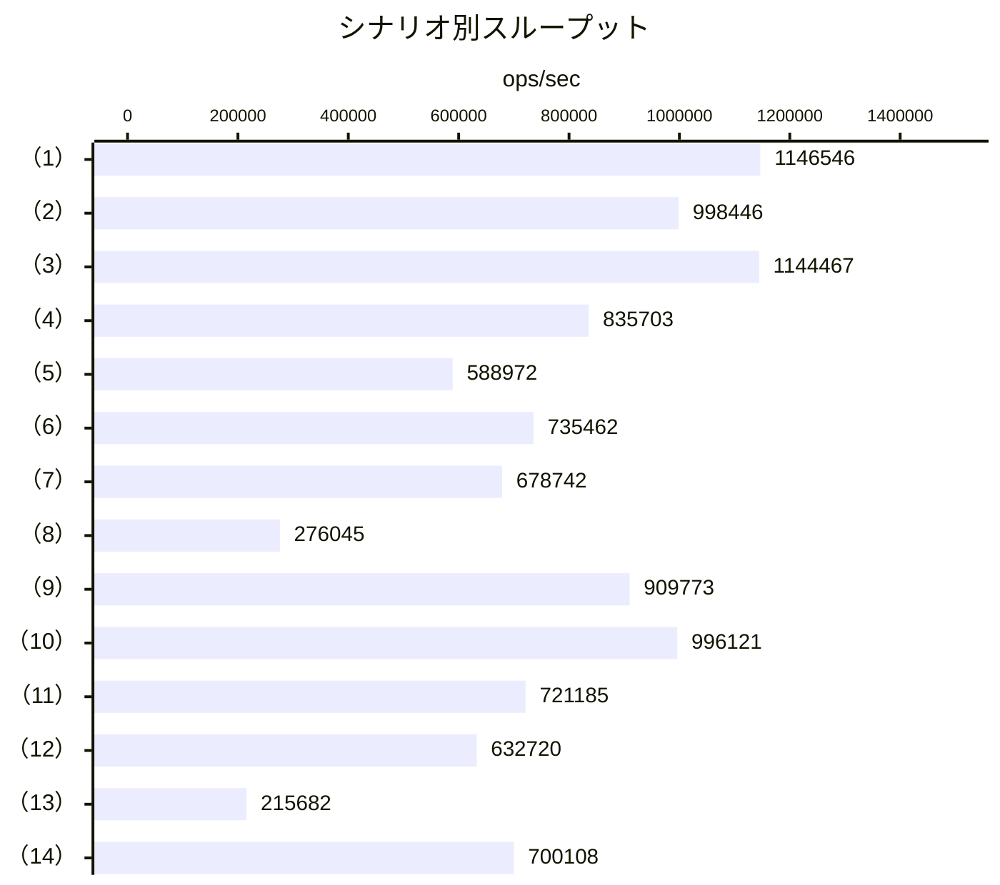

## 計測環境 \{#environment\}

| 項目    | 値                                   |
| ------- | ------------------------------------ |
| CPU     | 12th Gen Intel(R) Core(TM) i9-12900K |
| OS      | Linux x64                            |
| Node.js | v24.15.0                             |
| Vitest  | 4.1.11                               |
| 計測日  | 2026-09-26                           |

計測には `packages/asyncmux/benchmarks/asyncmux.bench.ts` を使用し、次のコマンドで実行しました。

```sh
npx vitest bench --config ./.config/vitest.bench.ts --run
```

:::note
ベンチマークの数値は、実行環境や同時に動作しているプロセスの影響で変動します。ここに掲載している値は特定のマシンでの計測例であり、性能を保証するものではありません。
:::

## スループット \{#throughput\}

横軸は 1 秒あたりのロック取得回数です。1 回の実行に複数のロック操作が含まれるシナリオは、1 回あたりのロック操作数で正規化しています。グラフの「（n）」は、[操作と計測結果](#results)の「操作」列に対応します。



## 操作と計測結果 \{#results\}

3 回計測した実行回数（`hz`）の中央値を掲載します。「ロック取得回数/秒」は、1 回あたりのロック操作数を掛けて正規化した値です。中断系の 2 シナリオはロックを取得しないため、グラフには含めていません。

| 操作   | 実行内容                                         | ロック操作数/回 | 実行回数/秒 | ロック取得回数/秒 |
| ------ | ------------------------------------------------ | --------------: | ----------: | ----------------: |
| （1）  | lock / release (no key)                          |               1 |   1,146,546 |         1,146,546 |
| （2）  | lock / release (key)                             |               1 |     998,446 |           998,446 |
| （3）  | rLock / release                                  |               1 |   1,144,467 |         1,144,467 |
| （4）  | rLock / release (key)                            |               1 |     835,703 |           835,703 |
| （5）  | 2 workers x 4 ops (same key)                     |               8 |      73,622 |           588,972 |
| （6）  | 2 workers x 16 ops (same key)                    |              32 |      22,983 |           735,462 |
| （7）  | 32 concurrent requests (no key)                  |              32 |      21,211 |           678,742 |
| （8）  | 128 concurrent requests (same key)               |             128 |       2,157 |           276,045 |
| （9）  | sequential x 16                                  |              16 |      56,861 |           909,773 |
| （10） | sequential x 64                                  |              64 |      15,564 |           996,121 |
| （11） | drain 50 queued R/W requests                     |              50 |      14,424 |           721,185 |
| （12） | drain 200 queued R/W requests                    |             200 |       3,164 |           632,720 |
| （13） | double release (throws LockReleasedError)        |               1 |     215,682 |           215,682 |
| （14） | reader-writer cache access (12R + 3W + global W) |              16 |      43,757 |           700,108 |
| —      | immediately aborted signal (rejects)             |               — |     152,145 |                 — |
| —      | abort while waiting in queue                     |               — |      96,851 |                 — |

## 結果の見方 \{#observations\}

- 非競合時のロック取得・解放は、1 秒あたり約 100 万回です。
- 読み取りロックのスループットは書き込みロックと同程度です。
- 同じキーへの 128 並行要求では、相互排他と FIFO を維持したまま約 28 万回/秒まで低下します。
- 二重解放や中断などのエラーパスも、1 秒あたり 9 万回以上を処理できます。

## 再計測 \{#rerun\}

ベンチマークの定義は `packages/asyncmux/benchmarks/asyncmux.bench.ts` にあります。手元の環境で計測する場合は、`packages/asyncmux` で次のコマンドを実行してください。

```sh
npx vitest bench --config ./.config/vitest.bench.ts --run
```
